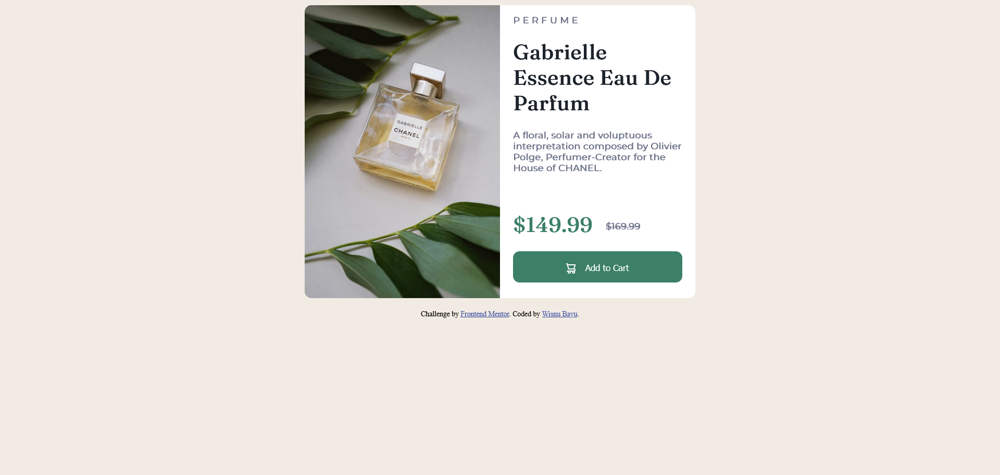

# Frontend Mentor - Product preview card component solution

This is a solution to the [Product preview card component challenge on Frontend Mentor](https://www.frontendmentor.io/challenges/product-preview-card-component-GO7UmttRfa). Frontend Mentor challenges help you improve your coding skills by building realistic projects. 

## Table of contents

- [Overview](#overview)
  - [The challenge](#the-challenge)
  - [Screenshot](#screenshot)
  - [Links](#links)
- [My process](#my-process)
  - [Built with](#built-with)
  - [Useful resources](#useful-resources)
- [Author](#author)

## Overview

### The challenge

Users should be able to:

- View the optimal layout depending on their device's screen size
- See hover and focus states for interactive elements

### Screenshot

### Links

<!-- - Solution URL: [Add solution URL here](https://wishba.github.io/product-preview-card-component-main/) -->
- Live Site URL: [card-component](https://wishba.github.io/product-preview-card-component-main/)

## My process

### Built with

- Semantic HTML5 markup
- CSS custom properties
- Flexbox
- CSS Grid
- Mobile-first workflow

### Useful resources

- [w3schools - how to css cards](https://www.w3schools.com/howto/howto_css_cards.asp)

## Author

- Website - [Wisnu Bayu](https://wishba.github.io/)
- Frontend Mentor - [@wishba](https://www.frontendmentor.io/profile/wishba)
- Twitter - [@wishba_](https://www.twitter.com/wishba_)
